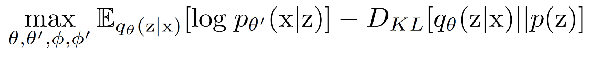

## **Conditional Variational Autoencoder (CVAE) with learnable priors**

### **Loss Function of a Variational Autoencoder**

<!--[ELBO](pics/VAE_Loss.PNG)-->

### **Loss Function of CVAE with learnable priors, *whereby c denotes a one-hot label***

<!--[ELBO_modified](pics/CVAE_learnable_prior_Loss.PNG)-->

### **Examples for conditionally sampled digits (*default settings in main.py were used*)**

### One example for mixed sampling from all digit-classes ###

